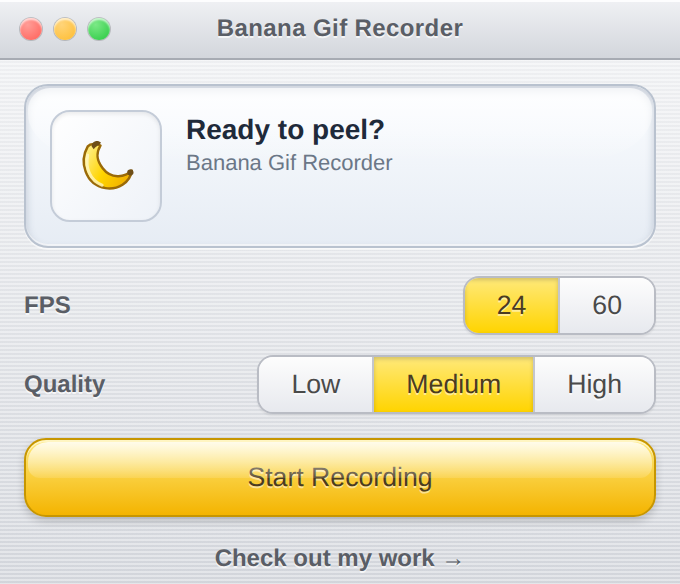
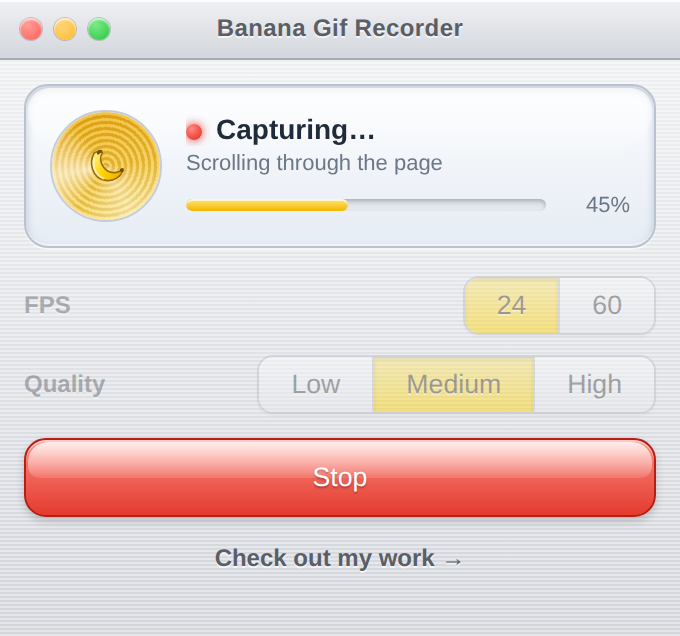
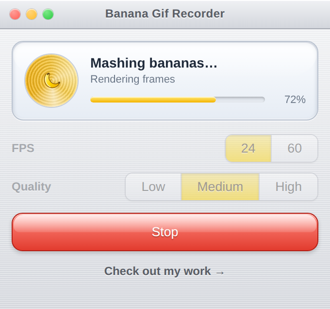
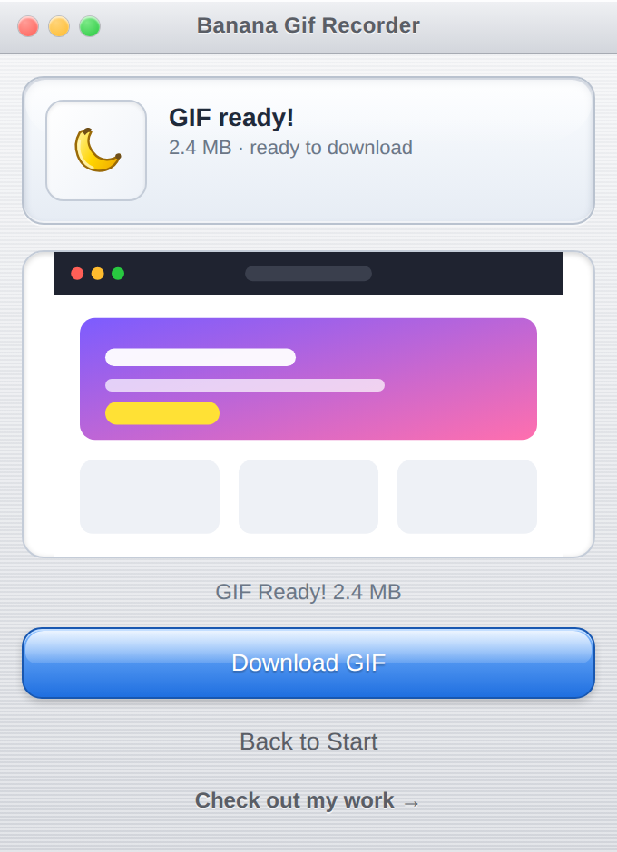

# 🍌 Banana Gif Recorder

Banana Gif Recorder is a tiny, banana-yellow Chrome extension that captures entire web pages in smooth, shareable GIFs. Perfect for creating portfolio showcases, sharing UI designs, and demonstrating full-page interactions—all processed locally on your machine.

It's wrapped in a playful, retro **"modern iTunes" interface**—brushed-metal chrome, a glossy status display, Aqua gel buttons, and a spinning record-style recording animation—so it's as fun to use as it is useful.

## Screenshots

### Main Interface

*Interface where you start your recording session.*

### Capturing Process

*Watch as the extension scrolls through your page, capturing every section—the album art spins like a record and a red **REC** light pulses while it works.*

### Rendering Frames

*The extension processes all captured frames and stitches them together into GIF animation.*

### Download Ready

*Your final GIF is ready! Download and share, full-page capture anywhere.*

## Features
- **Full-Page Capture**: Automatically scrolls and captures entire web pages in one smooth recording.
- **Buttery-Smooth GIFs**: High-FPS frame capture ensures your portfolio showcases and UI designs look professional.
- **Perfect for Showcases**: Create stunning GIFs of your projects, designs, or any web page to share in portfolios, presentations, or documentation.
- **Local Privacy**: Recording, rendering, and downloads happen entirely in your browser—your content never leaves your machine.

## Setup
1. Clone the repo: `git clone https://github.com/kabir0st/banana-gif-recorder.git`.
2. Open Chrome and navigate to `chrome://extensions`.
3. Toggle **Developer mode** in the top-right.
4. Click **Load unpacked** and select `banana-gif-recorder/`.
5. PIN the banana icon so it's easy to find.

## How to Use
1. Navigate to the page you want to capture (your portfolio, UI design, or any web page).
2. Click the banana icon to open the popup.
3. Press **Start Recording**. The extension automatically smooth-scrolls through the entire page, capturing every section.
4. Wait for processing. You'll see progress indicators during capture and rendering.
5. Hit **Download GIF** to save your smooth, full-page animation.
6. Use it in your portfolio, share UI designs with clients, or showcase your work anywhere!

**Perfect for:**
- 🎨 Portfolio project showcases
- 🖼️ UI/UX design presentations
- 📱 Demonstrating responsive layouts
- 🚀 Sharing web app features
- 📝 Creating documentation with visual examples

## Privacy
Your content never leaves your device. Banana Gif Recorder collects **no** personal data, uses **no** analytics or tracking, and makes **no** network requests—all recording, rendering, and downloading happen locally in your browser.

Read the full [Privacy Policy](PRIVACY_POLICY.md).

## Support the Project
If this saves you time (or meetings), consider buying me a coffee:
[Buy me a coffee](https://www.buymeacoffee.com/kabir0st).

You can also star the repo or file issues with ideas you'd like to see.
